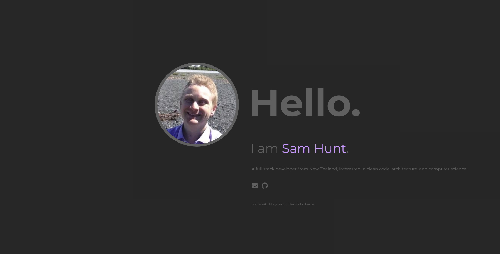

# Hello World 
A static website for [samhunt.dev](https://samhunt.dev) (Superceded by [hello-world-2](https://github.com/sam-hunt/hello-world-2))

This project was generated with [Hugo](https://github.com/angular/angular-cli) 0.54.0/extended and [Hallo](https://github.com/EmielH/hallo-hugo) 2.1.0.

## Development server

Run `hugo server -D --disableFastRender --ignoreCache --noHTTPCache` for a dev server with hot reload and cache busting.  

Navigate to `http://localhost:1313/`. The app will automatically reload if you change any of the source files.
